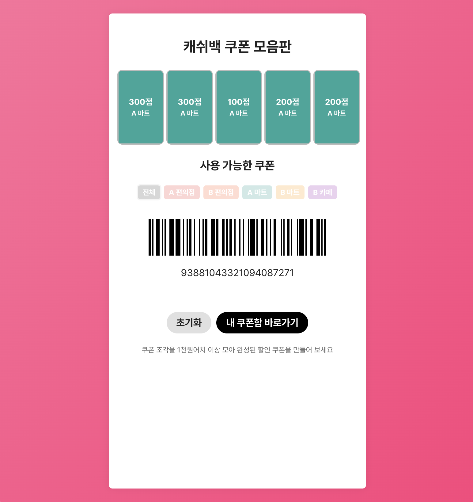

# 캐쉬백 쿠폰 모음판



> 쿠폰 조각을 모아 할인 쿠폰을 완성하고, 바코드로 즉시 사용할 수 있는 인터랙티브 웹 애플리케이션입니다.

## 데모

| Drag & Drop 동작 | 할인 쿠폰 생성 |
| ---------------- | -------------- |
|        |      |

## 주요 기능

- **드래그 앤 드롭 쿠폰 보드** : Motion One 지스처를 이용하여 쿠폰을 슬롯으로 자연스럽게 이동
- **제휴사 필터** : 슬롯에 배치된 쿠폰에 맞춰 사용 가능한 목록을 자동 필터링
- **완성 조건 판별** : 같은 제휴사 5장을 모으면 버튼이 활성화되어 할인 쿠폰 발급
- **바코드 생성** : jsBarcode로 20자리 난수를 CODE128 형식 SVG 바코드로 출력
- **모달 안내** : Motion 기반 커스텀 모달로 발급 완료 메시지를 표시
- **반응형 디자인** : 모바일 뷰(최대 420px) 기준 UI 최적화

## 기술 스택

- **React 18** + **Vite** + **TypeScript**
- **Motion One** (gesture / animation / layout)
- **jsBarcode** (SVG 바코드 생성)
- **Pretendard** (웹 폰트)

## 로컬 실행

```bash
# 의존성 설치
yarn            # 또는 npm i / pnpm i

# 개발 서버 실행
yarn dev        # 브라우저: http://localhost:5173
```

## 프로젝트 구조

```
src/
 ├─ components/
 │  ├─ CouponBoard.tsx   # 핵심 UI & 상태 관리
 │  ├─ CouponBoard.css   # 스타일
 │  └─ Modal.tsx         # 커스텀 모달 컴포넌트
 ├─ assets/              # 리액트 로고 등 정적 리소스
 ├─ App.tsx              # 루트 컴포넌트
 └─ main.tsx             # 진입점
```

## 라이선스

본 저장소는 학습 및 포트폴리오 용도로만 사용되며 상업적 사용을 금합니다.
